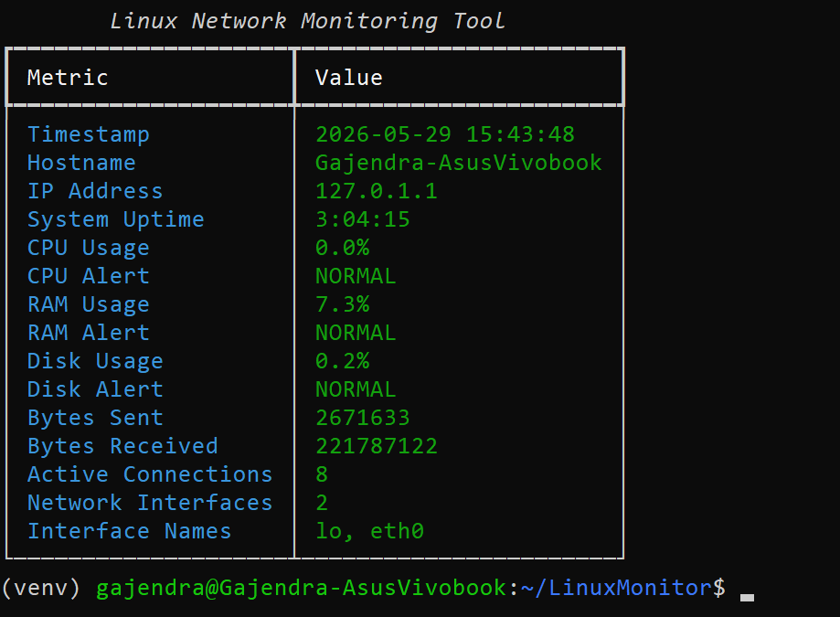
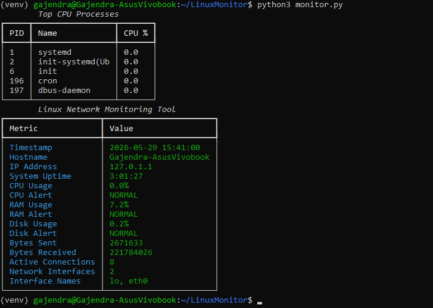
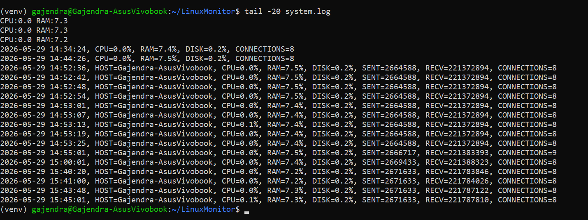
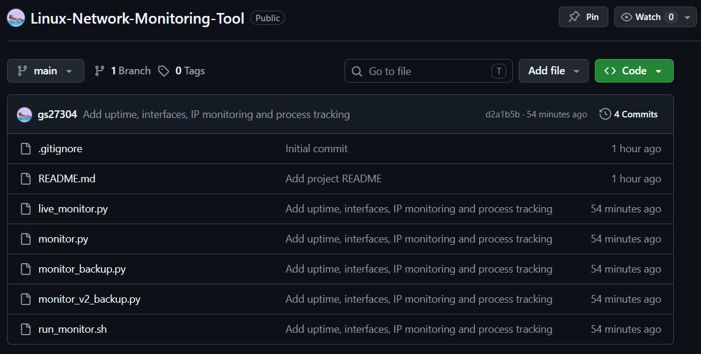

# Linux Network Monitoring Tool

A Linux-based system monitoring tool developed using Python, psutil, Bash scripting, and cron automation.


## Features

- CPU Monitoring
- RAM Monitoring
- Disk Monitoring
- Network Monitoring
- Active Connection Tracking
- Host Uptime Monitoring
- Interface Discovery
- IP Address Detection
- Top CPU Process Monitoring
- Threshold-Based Alerts
- Automated Logging
- Cron Automation


## Technologies Used

- Python 3
- psutil
- Rich
- Bash
- Linux (Ubuntu 24.04 WSL)
- Cron
- Git & GitHub

## Installation

Clone the repository:

```bash
git clone https://github.com/gs27304/Linux-Network-Monitoring-Tool.git
```

Install dependencies:

```bash
pip install psutil rich
```

Run:

```bash
python3 monitor.py
```

## Sample Output

Displays:

- CPU Usage
- RAM Usage
- Disk Usage
- Bytes Sent
- Bytes Received
- Active Connections

## Future Improvements

- Real-time refresh dashboard
- Email alerts
- Flask web dashboard
- SNMP monitoring
- Network interface statistics
- Export reports to CSV

## Screenshots

### Dashboard



### Top CPU Processes



### System Logs



### GitHub Repository


